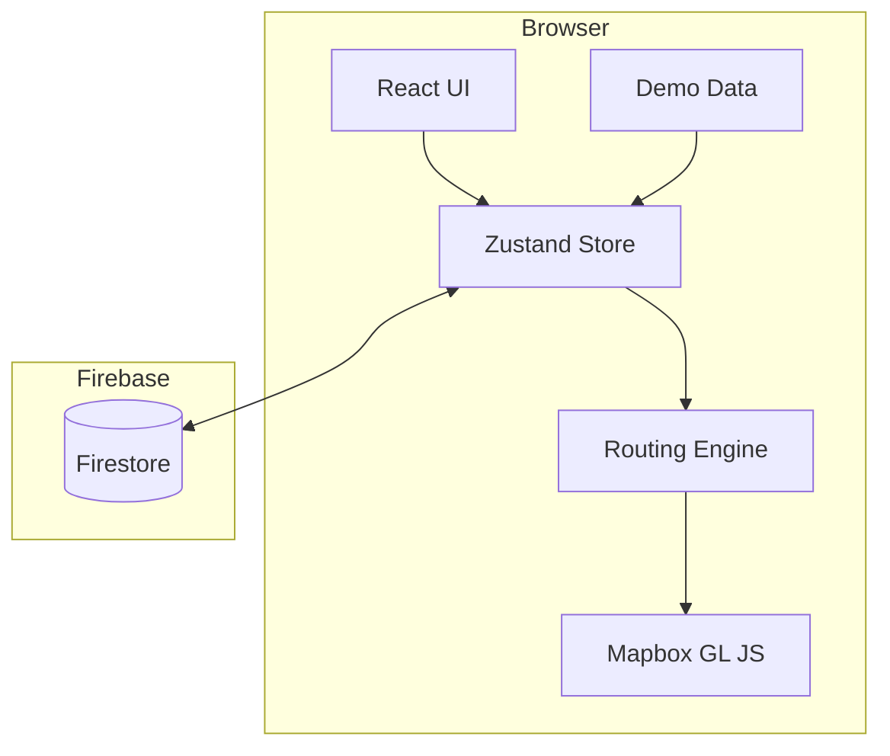

# Design Document: PathPlan

## Overview

PathPlan is a mobile-first campus navigation web app that computes optimized walking routes using a client-side graph-based routing engine. Community-submitted shortcuts, constraint toggles (accessibility, safety, crowd), and time-aware routing all run entirely in the browser for instant feedback. A Mapbox GL JS map renders animated routes and a community shortcut overlay with a polished glassmorphism UI.

**Stack**: React + TypeScript, Mapbox GL JS, Zustand, Dijkstra's algorithm, Firebase Firestore.

### Key Design Goals

- Sub-1-second initial load with preloaded demo data
- All routing computed client-side — no round-trips for route computation
- Constraint toggles re-trigger routing instantly (<200ms perceived latency)
- Every interaction has visible animated feedback
- Demo flow works out of the box with zero setup

---

## Demo Flow (Priority)

The app is optimized for this exact demo sequence. Every step must be visually clear and feel instant:

1. **Load** → Map renders with campus buildings and community shortcuts visible
2. **Search** → Type "Library", select it as start; type "Engineering", select as end
3. **Route** → Route animates onto the map (600–900ms draw); bottom sheet slides up
4. **Toggle constraint** → Flip Accessibility Mode; route re-animates with updated path
5. **Toggle again** → Flip Safety Mode; route updates again
6. **Community layer** → Enable overlay; shortcuts appear as colored paths
7. **Shortcut detail** → Tap a shortcut; detail panel slides up with tags and votes
8. **Add shortcut** → Draw a new path; submit; confirmation shown; return to map

Preloaded demo data must make the app feel alive immediately — no empty states on first load.

---

## Architecture



The browser is the primary execution environment. Firestore is only used to persist and fetch community shortcuts and votes. All routing, graph construction, and constraint logic runs client-side.

### Data Flow

1. **Load**: Demo data seeds the Zustand store. Map renders buildings; community layer is ready.
2. **Route request**: User picks start/end + constraints → Router reads graph from store, applies weights, runs Dijkstra's, emits a `Route` → Map animates the line, bottom sheet slides up.
3. **Constraint change**: Store updates → Router recomputes → Map re-animates route.
4. **Shortcut submit**: Frontend writes to Firestore → store updates graph with new edge.
5. **Vote**: Frontend updates Firestore doc → store updates edge weight.

---

## Components and Interfaces

### Folder Structure (Flat)

```
src/
  components/
    MapView.tsx            # Mapbox GL JS wrapper + all map layers
    SearchPanel.tsx        # Start/end inputs with autocomplete
    ConstraintToggles.tsx  # Fastest / Accessibility / Safety / Low Crowd
    TimeBudgetSelector.tsx
    RouteBottomSheet.tsx   # Slide-up panel: time, explanation, constraints
    ShortcutDetailPanel.tsx
    AddShortcutScreen.tsx  # Waypoint drawing UI
    VotingControls.tsx
  engine/
    graph.ts               # Graph construction
    router.ts              # Dijkstra's + constraint weighting
    explanation.ts         # Route explanation string generator
  store/
    useStore.ts            # Zustand store
  data/
    demo.ts                # Preloaded buildings, shortcuts, ratings
  firebase/
    shortcuts.ts           # Firestore read/write for shortcuts and votes
```

Components are kept flat — no nested component folders. Each file owns one clear responsibility.

### Core TypeScript Interfaces

```typescript
interface LatLng { lat: number; lng: number; }

interface Building {
  id: string;
  name: string;
  coordinates: LatLng;
  entrances: Entrance[];
}

interface Entrance {
  id: string;
  coordinates: LatLng;
  tags: ('accessible' | 'main' | 'stair-free')[];
}

interface PathSegment {
  id: string;
  from: string;
  to: string;
  distance: number; // meters
  tags: SegmentTag[];
  weights: SegmentWeights;
  shortcutId?: string;
}

type SegmentTag =
  | 'indoor' | 'stair' | 'ramp' | 'elevator'
  | 'poorly-lit' | 'isolated' | 'main-walkway' | 'well-lit' | 'crowded';

interface SegmentWeights {
  distance: number;
  crowdLevel: number;      // 0–1
  safetyScore: number;     // 0–1, higher = safer
  accessibilityScore: number; // 0–1, higher = more accessible
  popularity: number;      // upvotes - downvotes
}

interface Shortcut {
  id: string;
  coordinates: LatLng[];
  tags: ('indoor' | 'hidden-shortcut' | 'unsafe-at-night' | 'crowded-between-classes')[];
  upvotes: number;
  downvotes: number;
  popularityScore: number;
}

interface Route {
  segments: PathSegment[];
  totalDistance: number;  // meters
  estimatedTime: number;  // minutes
  explanation: string;
  activeConstraints: Constraint[];
}

type Constraint = 'fastest' | 'accessibility' | 'safety' | 'low-crowd';
type TimeBudget = 5 | 10 | 15;
```

### Zustand Store

```typescript
interface AppState {
  graph: Graph;
  shortcuts: Shortcut[];
  activeRoute: Route | null;
  constraints: Constraint[];
  timeBudget: TimeBudget;
  communityLayerEnabled: boolean;
  sessionVotes: Set<string>;
  startLocation: Building | null;
  endLocation: Building | null;
}
```

---

## Data Models

### Graph Model

```typescript
interface Graph {
  nodes: Map<string, GraphNode>;
  edges: Map<string, PathSegment[]>; // nodeId → outgoing edges
}

interface GraphNode {
  id: string;
  coordinates: LatLng;
  buildingId?: string;
}
```

Built once on load from demo data; updated incrementally when shortcuts are added.

### Weight Computation (Readable, Easy to Iterate)

Edge cost for Dijkstra's is a simple weighted sum:

```typescript
function edgeCost(seg: PathSegment, cfg: RouterConfig): number {
  const w = seg.weights;
  return (
    cfg.wDistance * w.distance
    + cfg.wCrowd   * w.crowdLevel
    - cfg.wSafety  * w.safetyScore
    - cfg.wAccess  * w.accessibilityScore
    - cfg.wPop     * Math.max(0, w.popularity) / 10
  );
}
```

Constraint presets set the `w_*` coefficients. Stair/unsafe segments are excluded (infinite cost) when the relevant constraint is active — no complex filtering needed.

| Constraint     | wDistance | wCrowd | wSafety | wAccess | wPop |
|---------------|-----------|--------|---------|---------|------|
| Fastest        | 2.0       | 0.5    | 0.5     | 0.5     | 1.0  |
| Accessibility  | 1.0       | 0.5    | 1.0     | 3.0     | 1.0  |
| Safety         | 1.0       | 0.5    | 3.0     | 1.0     | 1.0  |
| Low Crowd      | 1.0       | 3.0    | 1.0     | 1.0     | 1.0  |

Time budget adjusts shortcut popularity bonus:

| Time Budget | Shortcut bonus |
|------------|----------------|
| 5 min      | wPop = 2.0     |
| 10 min     | wPop = 1.0     |
| 15 min     | wPop = 0.5     |

### Firestore Schema

**Collection: `shortcuts`**

| Field          | Type      | Notes                    |
|---------------|-----------|--------------------------|
| id            | string    | auto-generated           |
| coordinates   | array     | [{lat, lng}, ...]        |
| tags          | string[]  | enum values              |
| upvotes       | number    | default 0                |
| downvotes     | number    | default 0                |
| popularityScore | number  | upvotes - downvotes      |
| createdAt     | timestamp |                          |

No other collections needed. Buildings and graph data live in `demo.ts` on the client.

---

## Animation and Interaction Timing

All interactions must feel instant and polished. These are hard requirements for demo quality:

| Interaction | Timing | Easing |
|-------------|--------|--------|
| Route line draw (start → end) | 600–900ms | `ease-in-out` |
| Bottom sheet slide up | 300–400ms | `cubic-bezier(0.4, 0, 0.2, 1)` |
| Bottom sheet drag to close | 200–300ms | `ease-out` |
| Constraint toggle state change | 200–300ms | `ease-in-out` |
| Route re-animation on constraint change | 400–600ms | `ease-in-out` |
| Community layer appear/disappear | 300ms | `ease-in-out` |
| Shortcut detail panel slide up | 250–350ms | `cubic-bezier(0.4, 0, 0.2, 1)` |
| Button/toggle tap feedback | <100ms | immediate |
| Route computation + UI update | <200ms total | — |

Route computation must complete and trigger the animation start within 200ms of the user's interaction. Since routing is client-side Dijkstra's on a small campus graph, this is easily achievable.

---

## Correctness Properties

*A property is a characteristic or behavior that should hold true across all valid executions of a system — essentially, a formal statement about what the system should do. Properties serve as the bridge between human-readable specifications and machine-verifiable correctness guarantees.*

### Property 1: Route only uses edges present in the graph

*For any* graph and any pair of connected nodes, the route computed by the router should consist exclusively of edges that exist in the graph, and the route's total weight should equal the sum of the individual edge weights along the path.

**Validates: Requirements 3.1**

---

### Property 2: Constraint application satisfies its invariant

*For any* graph with mixed-tag segments and any single active constraint, the route computed with that constraint active should satisfy the constraint's invariant: accessibility routes contain no stair-tagged segments, safety routes contain no poorly-lit or isolated segments, and low-crowd routes have a lower average crowd weight than the unconstrained route on the same graph.

**Validates: Requirements 3.2, 5.4, 5.5, 5.6, 10.1, 11.1**

---

### Property 3: Walking time formula is correct

*For any* computed route, the estimated walking time in minutes should equal `totalDistance / 1.4 / 60`, where 1.4 is the standard walking speed in meters per second.

**Validates: Requirements 3.5**

---

### Property 4: Vote popularity invariant

*For any* shortcut after any sequence of upvote and downvote operations, the `popularityScore` should always equal `upvotes - downvotes`.

**Validates: Requirements 8.2, 7.4**

---

### Property 5: Shortcut submission round-trip

*For any* valid shortcut (coordinates.length ≥ 2), writing it to Firestore and reading it back should produce a record with all required fields (id, coordinates, tags, upvotes, downvotes, popularityScore) intact and with `popularityScore === upvotes - downvotes`.

**Validates: Requirements 7.3, 7.4**

---

## Error Handling

| Condition | Behavior |
|-----------|----------|
| No path between start and end | Router returns `null`; UI shows "No path found" |
| No stair-free path (accessibility mode) | Return best available; show "Fully accessible route not available" |
| No safe path (safety mode) | Return safest available; show "Fully safe route could not be constructed" |
| Route exceeds time budget | Show route anyway; display time-exceeded warning |
| Empty start or end on submit | Inline validation on the empty field; no computation |
| Shortcut with < 2 points | Validation error; no Firestore write |
| Duplicate vote in session | Toast "You've already voted"; no Firestore write |
| Mapbox unavailable | Fallback message: "Map cannot be loaded" |
| Firestore unavailable | Error toast; app continues with local data |

---

## Testing Strategy

### Approach

Two complementary layers:
- **Property tests** — verify universal correctness across randomized inputs (fast-check)
- **Unit tests** — verify specific edge cases and error conditions

Keep the test suite lean. Property tests cover the core invariants; unit tests handle the cases that are hard to express as properties.

### Property-Based Tests (5 total)

**Library**: [fast-check](https://github.com/dubzzz/fast-check)

Each test runs **100 iterations minimum**. Each test is tagged:

```
// Feature: path-plan, Property N: <property_text>
```

| Test | Property |
|------|----------|
| Route uses valid edges | Property 1 |
| Constraint satisfies invariant | Property 2 |
| Walking time formula | Property 3 |
| Vote popularity invariant | Property 4 |
| Shortcut round-trip | Property 5 |

**Arbitraries needed:**

- `arbLatLng` — random lat/lng within campus bounding box
- `arbPathSegment` — random segment with random tags and weights
- `arbGraph` — random connected graph
- `arbShortcut` — random shortcut with ≥2 coordinates
- `arbConstraint` — one of the four constraint values

```typescript
// Example
import fc from 'fast-check';
import { describe, it, expect } from 'vitest';

describe('Router', () => {
  it('walking time formula is correct', () => {
    // Feature: path-plan, Property 3: Walking time estimate is mathematically correct
    fc.assert(
      fc.property(arbRoute(), (route) => {
        expect(route.estimatedTime).toBeCloseTo(route.totalDistance / 1.4 / 60, 5);
      }),
      { numRuns: 100 }
    );
  });
});
```

### Unit Tests (Edge Cases Only)

**Router:**
- Empty graph → null route
- Start equals end → zero-distance route
- Accessibility mode + no stair-free path → fallback route + notification
- Safety mode + no safe path → fallback route + notification
- Equal-weight routes → prefer higher safety+popularity score (Req 3.6)

**Input validation:**
- Empty start field → validation error, no computation
- Empty end field → validation error, no computation
- Shortcut with 0 or 1 points → rejected
- Shortcut with 2 points → accepted

**Demo data:**
- ≥ 10 buildings present
- ≥ 10 shortcuts present
- All shortcuts have ≥ 2 coordinate points

**UI state:**
- Constraint toggle while route active → recomputation triggered
- Community layer toggle → shortcut features added/removed from map

### Test Configuration

```typescript
// vitest.config.ts
export default {
  test: {
    environment: 'jsdom',
    setupFiles: ['./src/test/setup.ts'],
  }
}
```
